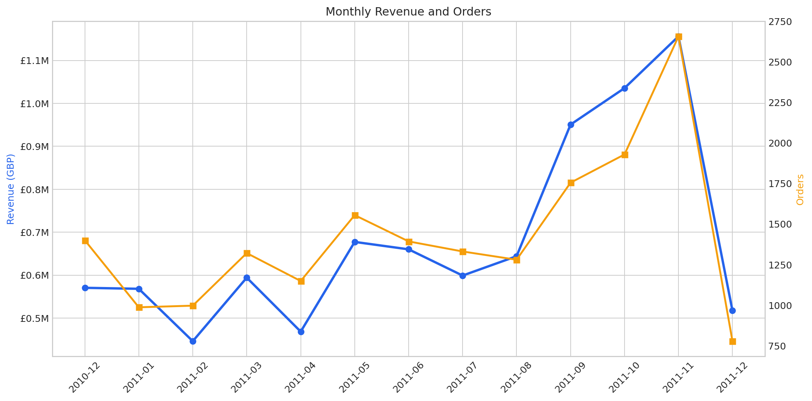
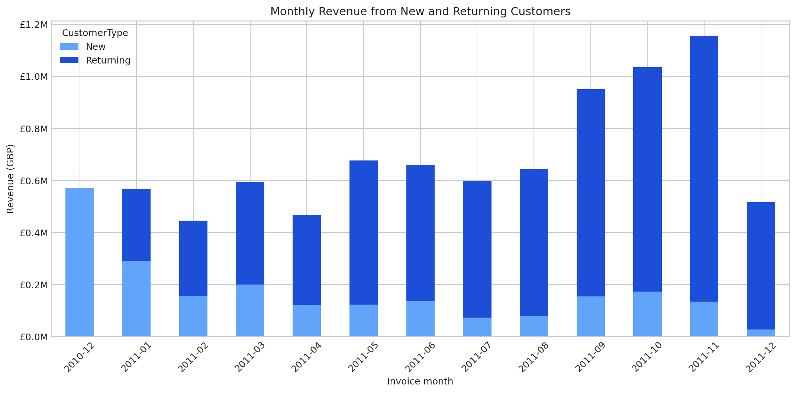
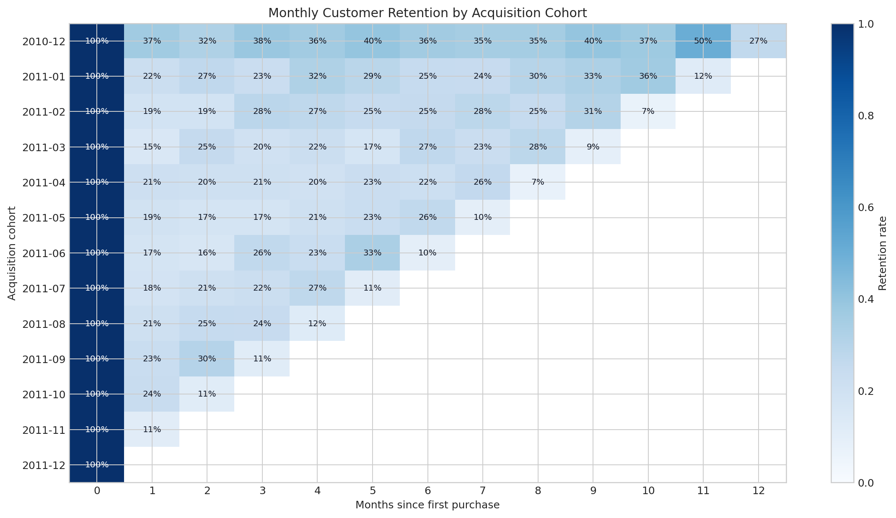
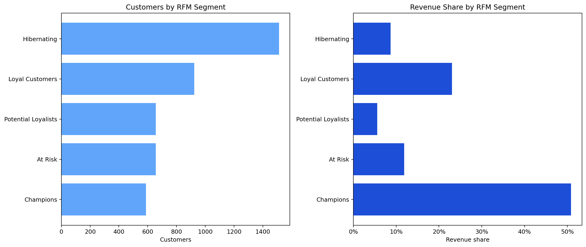
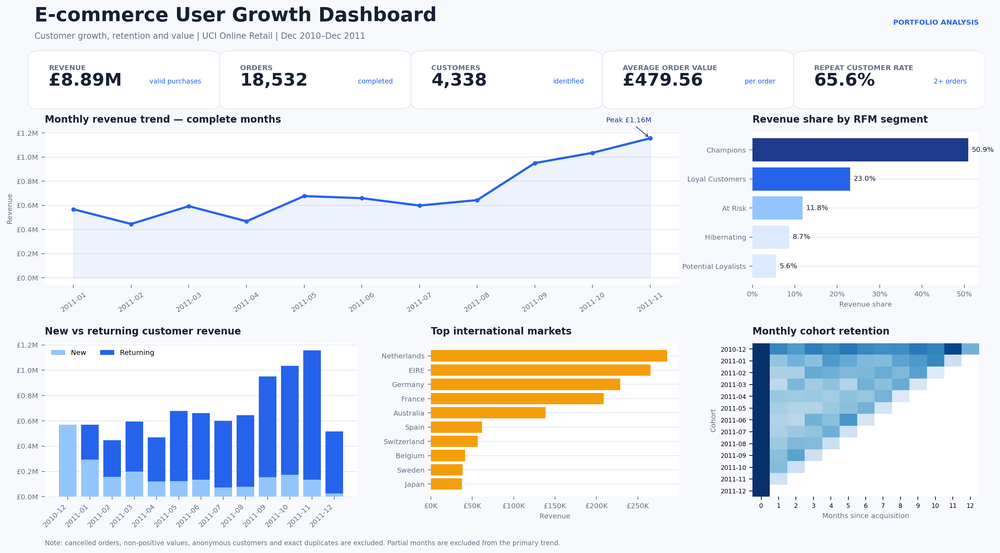
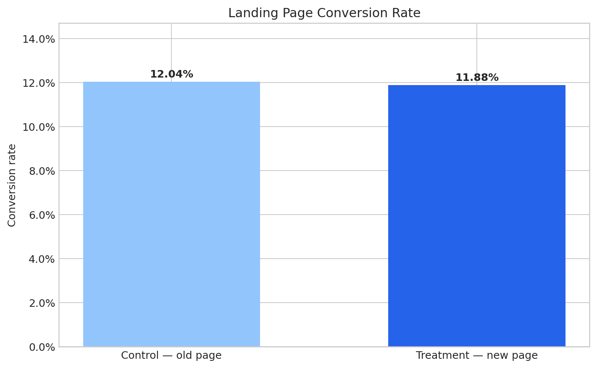

# E-commerce User Growth & Conversion Analysis

An end-to-end analytics portfolio project using 541,909 transactions from the UCI Online Retail dataset.

## Business objective

The project examines customer growth, retention, repeat purchase behavior, and customer value. It is designed to answer:

- How are revenue, orders, and active customers changing over time?
- How well are newly acquired customers retained?
- Which customers generate the most value?
- Which customer groups should receive retention or reactivation campaigns?
- Does a redesigned landing page improve visitor-to-purchase conversion?

The portfolio uses two independent public datasets across one lifecycle framework: landing-page experimentation covers visitor conversion, while transaction analysis covers post-purchase retention and value. The datasets are not joined at user level and are not presented as records from the same company.

## Analysis workflow

1. Data quality assessment and cleaning
2. Business KPI and sales trend analysis
3. Cohort retention analysis
4. RFM customer segmentation
5. SQL analysis
6. Tableau dashboard
7. A/B testing extension using a separate experiment dataset

## Technology

Python, pandas, NumPy, SQL, Tableau, Cohort Analysis, RFM Segmentation, A/B Testing

## Data source

UCI Machine Learning Repository, **Online Retail** dataset:  
https://archive.ics.uci.edu/dataset/352/online+retail

Kaggle, **E-commerce A/B Testing** dataset:  
https://www.kaggle.com/datasets/zhangluyuan/ab-testing

The UCI dataset is licensed under CC BY 4.0. Raw and processed data files are excluded from version control; see `data/README.md` for setup instructions and source attribution.

## Repository structure

```text
ecommerce-user-growth-analysis/
├── README.md
├── data/
├── notebooks/
├── sql/
├── dashboard/
├── images/
├── scripts/
├── docs/
├── requirements.txt
└── .gitignore
```

## Reproduce the project

```bash
python -m venv .venv
source .venv/bin/activate        # Windows: .venv\Scripts\activate
pip install -r requirements.txt
```

Download both public datasets and follow `data/README.md`. Then run the notebooks in numerical order:

```text
01_data_cleaning.ipynb
02_business_analysis.ipynb
03_cohort_retention.ipynb
04_rfm_segmentation.ipynb
05_ab_testing.ipynb
```

Build the optional SQLite database and portfolio dashboard with:

```bash
python scripts/build_sqlite_database.py
python scripts/build_dashboard.py
```

## Current status

- [x] Repository scaffold
- [x] Data-cleaning notebook
- [x] Business KPI analysis
- [x] Cohort retention analysis
- [x] RFM segmentation
- [x] SQL scripts
- [x] Dashboard and Tableau-ready data sources
- [x] A/B testing extension

## Initial findings

- The cleaned customer-level dataset contains **392,692** transaction lines, **18,532** orders, and **4,338** identified customers.
- Valid purchase revenue totals **£8.89M**, with an average order value of **£479.56**.
- **65.6%** of customers placed at least two distinct orders.
- Returning customers generated **74.7%** of total revenue.
- The top **20%** of customers generated **74.7%** of revenue, indicating high customer-value concentration.
- The United Kingdom contributed **82.0%** of revenue; the Netherlands, EIRE, Germany, and France led international sales.
- November 2011 was the strongest complete month, generating **£1.16M** in revenue.
- Mature acquisition cohorts achieved **23.7%** weighted month-1 retention.
- After excluding incomplete observation windows, the **7-day repeat purchase rate was 8.7%** and the **30-day rate was 22.0%**.
- RFM segmentation identified **589 Champions (13.6% of customers)** who generated **50.9% of revenue**.
- **1,513 Hibernating customers (34.9%)** generated only **8.7% of revenue**, supporting selective rather than blanket reactivation.
- The cleaned landing-page experiment contains **290,584 unique users**. Control converted at **12.04%** versus **11.88%** for treatment.
- The redesign effect was **−0.158 percentage points** with a **95% CI of [−0.394, 0.078] pp** and **p = 0.1899**; the evidence does not support full rollout.













## Business recommendations

- Protect Champions and Loyal Customers with differentiated benefits because they generate most revenue.
- Prioritize At Risk customers for targeted win-back campaigns; use lower-cost reactivation for Hibernating users.
- Build a second-purchase habit through onboarding, replenishment reminders, and lifecycle messaging.
- Do not roll out the tested landing-page redesign based on the current evidence; refine the hypothesis and run a new controlled experiment.

## Methodology notes

Important implementation decisions and interview-ready technical challenges are documented in `docs/interview_notes.md`.
